# 🤖 CompuFest[1] — AI Workshop El Umbral de los Autómatas Pensantes: Iniciación a los Laberintos de LangChain, LangGraph y DeepAgents

[](https://github.com/Vania-Dev/CompuFest-1-Workshop/graphs/contributors)
[](https://github.com/Vania-Dev/CompuFest-1-Workshop/forks)
[](https://github.com/Vania-Dev/CompuFest-1-Workshop/stargazers)
[](https://github.com/Vania-Dev/CompuFest-1-Workshop/issues)
[](https://github.com/Vania-Dev/CompuFest-1-Workshop/blob/main/LICENSE.txt)

<!-- PROJECT LOGO -->
<br />
<div align="center">
  <a href="https://github.com/Vania-Dev">
    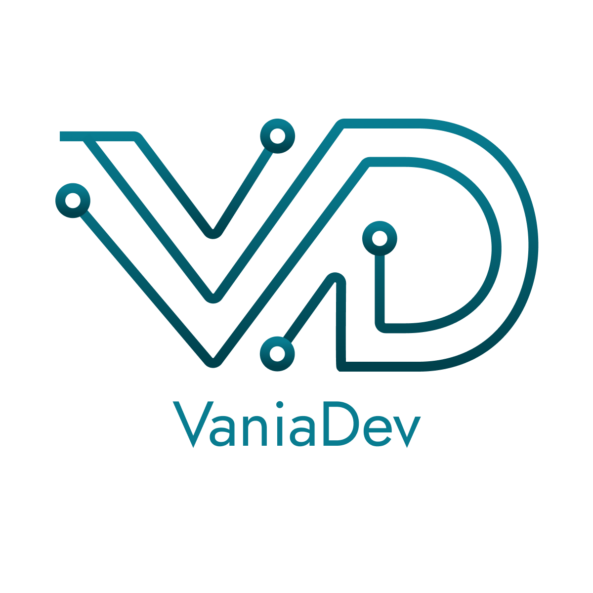
  </a>

  <h3 align="center">El Umbral de los Autómatas Pensantes: Iniciación a los Laberintos de LangChain, LangGraph y DeepAgents</h3>

  <a href="https://www.youtube.com/playlist?list=PLZLvS5NXZVysi0nnN6B3XpSw_6q-0ur5x">
    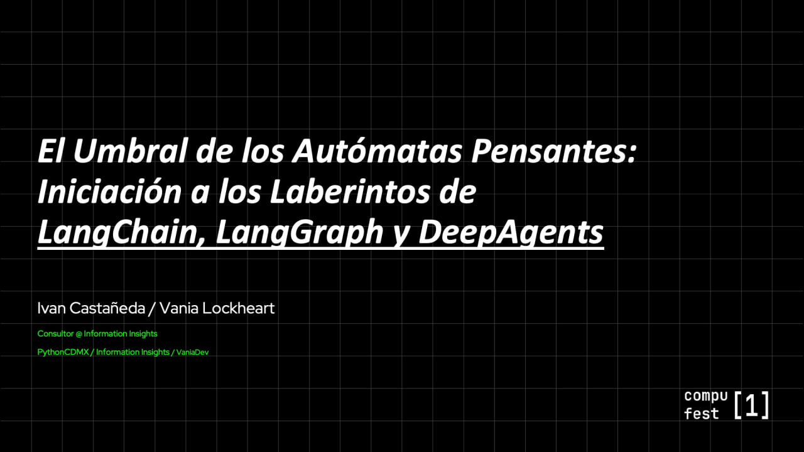
  </a>

  <p align="center">
    <br />
    <a href="https://github.com/Vania-Dev/CompuFest-1-Workshop">Aditional material</a>
    ·
    <a href="https://github.com/Vania-Dev/CompuFest-1-Workshop/issues/new?labels=bug&template=bug-report---.md">Report an Error</a>
    ·
    <a href="https://github.com/Vania-Dev/CompuFest-1-Workshop/issues/new?labels=enhancement&template=feature-request---.md">Request an Upgrade</a>
  </p>
</div>

## ✨ About Project

Hands-on workshop presented at **CompuFest[1]**, designed to introduce developers to building AI-powered applications using **LangChain**, **LangGraph**, and **DeepAgents** with local LLMs via Ollama.

Each folder is a self-contained learning module that progressively builds on the previous one — from simple prompt templates to autonomous agents with memory.

---

## 📁 Project Structure

```
CompuFest-1-Workshop/
├── LangChain/
│   ├── 01_PromptTemplate.py     # Basic prompt formatting with PromptTemplate
│   ├── 02_Chain.py              # Building a simple LLM chain with LCEL
│   └── 03_SequentialChain.py   # Multi-step sequential chain
├── LangGraph/
│   ├── 01_SimpleNode.py         # Single-node state graph
│   ├── 02_LogicRouter.py        # Conditional routing between nodes
│   └── 03_LoopGraph.py          # Self-improving loop graph
├── DeepAgents/
│   ├── 01_HelloWorld.py         # Agent with two basic tools
│   ├── 02_MultipleTools.py      # Agent with multiple utility tools
│   └── 03_AgentMemory.py        # Agent with conversation memory
├── main.py
├── requirements.txt
└── pyproject.toml
```

---

## 📦 Modules

### 🔗 LangChain — Prompt & Chain Fundamentals

Covers the core building blocks of LangChain: prompt templates, model invocation, and chaining steps together using LCEL (LangChain Expression Language).


### 🕸️ LangGraph — Stateful Graph Workflows

Introduces stateful, graph-based workflows where nodes process a shared state and edges define the execution flow — including conditional routing and loops.

### 🤖 DeepAgents — Tool-Using Autonomous Agents

Builds agents that can reason, select tools, and maintain conversation history across turns using `create_deep_agent` from the `deepagents` library.


## 🔄 Flow Diagrams

### LangChain — Prompt Template (`01_PromptTemplate.py`)

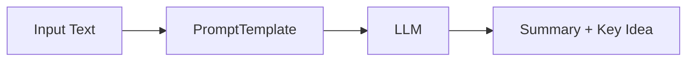

---

### LangChain — Chain (`02_Chain.py`)

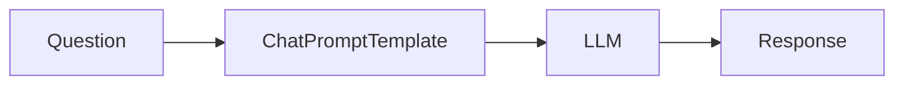

---

### LangChain — Sequential Chain (`03_SequentialChain.py`)

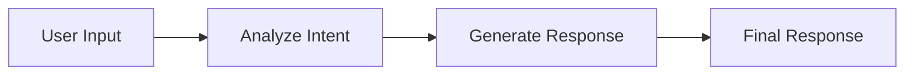

---

### LangGraph — Simple Node (`01_SimpleNode.py`)

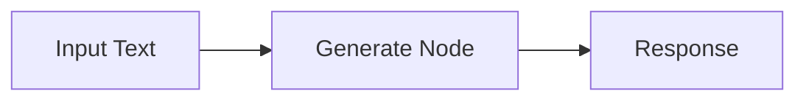

---

### LangGraph — Logic Router (`02_LogicRouter.py`)

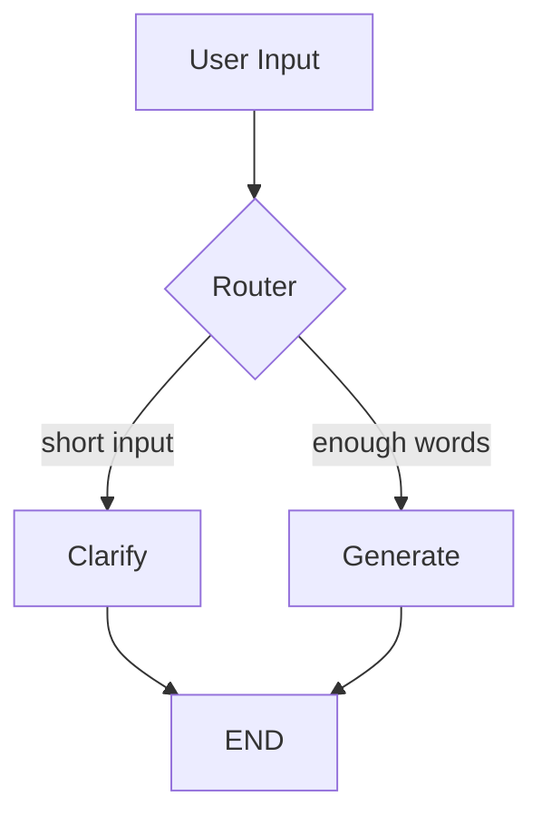

---

### LangGraph — Loop Graph (`03_LoopGraph.py`)

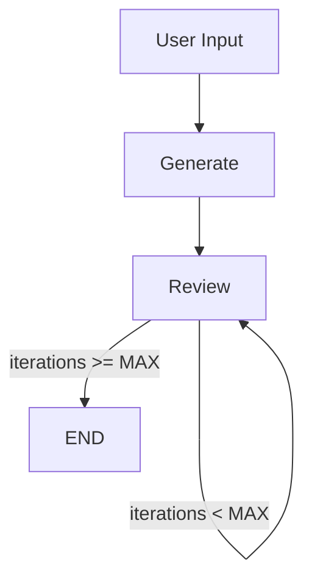

---

### DeepAgents — Hello World (`01_HelloWorld.py`)

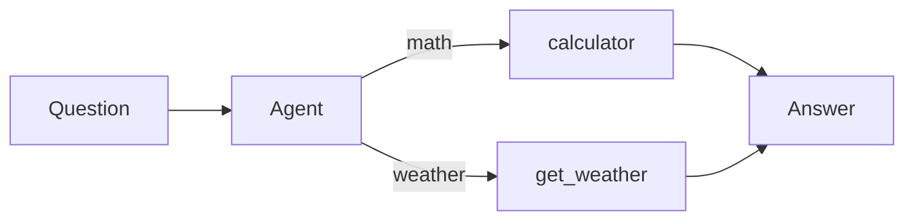

---

### DeepAgents — Multiple Tools (`02_MultipleTools.py`)

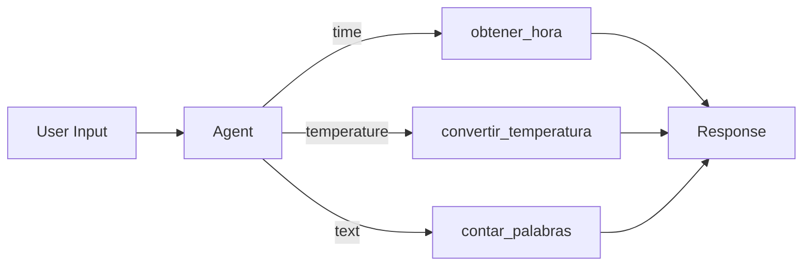

---

### DeepAgents — Agent with Memory (`03_AgentMemory.py`)

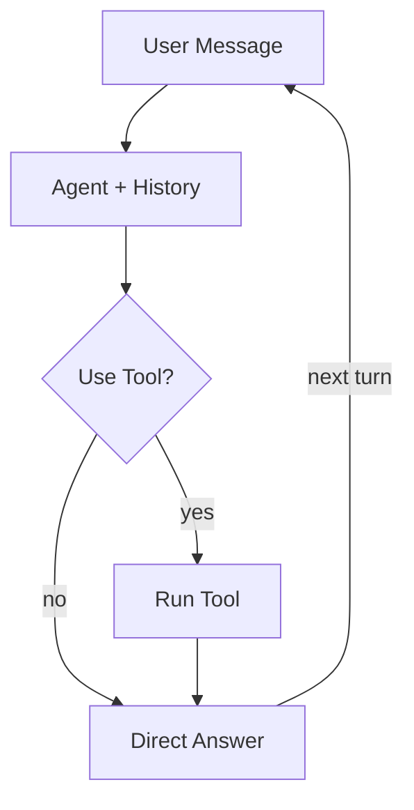

---

## ⚙️ Requirements

```
langchain==1.2.15
langchain-classic>=1.0.0
langchain-community==0.4
langchain-core==1.2.27
langchain-ollama==1.0.1
langgraph>=1.1.6
deepagents>=0.5.1
```

> **Python >= 3.11** required.  
> All examples use **Ollama** as the local LLM backend. Make sure Ollama is running and the required models are pulled before executing any script.

### Install

```bash
# Using pip
pip install -r requirements.txt

# Using uv (recommended)
uv sync
```

### Pull required models

```bash
ollama pull gpt-oss:20b   # used in LangChain and LangGraph examples
ollama pull qwen3:14b     # used in DeepAgents examples
```

---

## 🚀 Running Examples

```bash
# LangChain
uv run LangChain/01_PromptTemplate.py
uv run LangChain/02_Chain.py
uv run LangChain/03_SequentialChain.py

# LangGraph
uv run LangGraph/01_SimpleNode.py
uv run LangGraph/02_LogicRouter.py
uv run LangGraph/03_LoopGraph.py

# DeepAgents
uv run DeepAgents/01_HelloWorld.py
uv run DeepAgents/02_MultipleTools.py
uv run DeepAgents/03_AgentMemory.py
```

---

## 🧠 Learning Path

```
LangChain/01  →  LangChain/02  →  LangChain/03
     ↓
LangGraph/01  →  LangGraph/02  →  LangGraph/03
     ↓
DeepAgents/01 →  DeepAgents/02 →  DeepAgents/03
```

Each step introduces one new concept on top of the previous, making this workshop suitable for developers new to LLM application development.

<!-- LICENSE -->
## 📄 License

Distributed under the MIT license. See the `LICENSE.txt` file for more information.


<!-- CONTACT -->
## 📧 Contacto

[](https://youtube.com/@VANIADEV)
[](https://www.instagram.com/vania_dev_/)
[](https://www.tiktok.com/@vania_dev_)
[](https://www.facebook.com/SMAEMX)
[](https://beacons.ai/vaniadev)
[](https://www.linkedin.com/in/ivan-castaneda-nazario/)
[](https://vaniadev.super.site/)
[](https://buymeacoffee.com/vania_vaniusha)

---

<div align="center">

**Hazlo con el tipo de ❤️ que deja huellas en el alma**

[⭐ Star this repo](https://github.com/Vania-Dev/CompuFest-1-Workshop) • [🐛 Report Bug](https://github.com/Vania-Dev/CompuFest-1-Workshop/issues) • [✨ Request Feature](https://github.com/Vania-Dev/CompuFest-1-Workshop/issues)

</div>